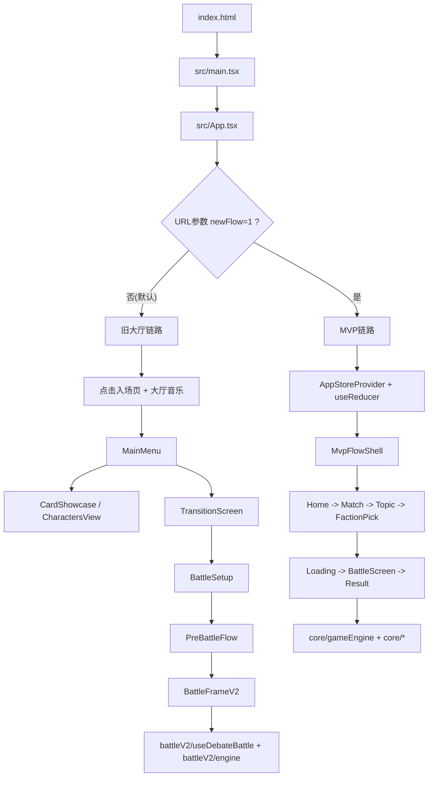
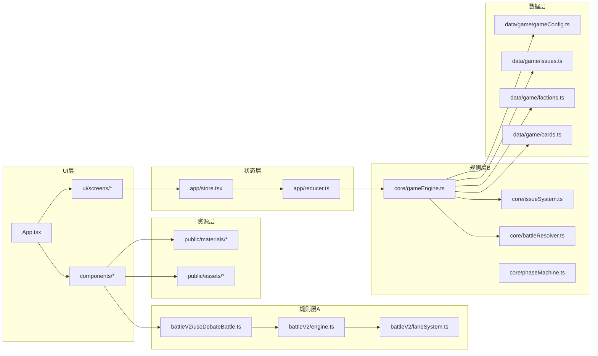

# 项目可视化总览（Project Visualization）

> 生成时间：2026-03-23  
> 依据：当前仓库真实代码结构（`src/` 主链路）  
> 说明：当前会话未检测到可直接调用的 `super powers` MCP 接口，因此采用“代码扫描 + 可视化文档”方式输出。

## 1. 一句话理解项目

这是一个以“百家争鸣”为题材的卡牌对战项目，当前仓库存在 **双运行链路**：
- 链路 A（默认）：旧版大厅 UI + 新版 `battleV2` 战斗机制（当前主试玩路径）
- 链路 B（可选）：`?newFlow=1` 触发的 `MvpFlowShell` 状态机流程（`core` + `app/reducer`）

## 2. 入口与运行路径可视化



## 3. 架构分层图



## 4. 目录规模快照（代码扫描）

| 目录 | 文件数 | 说明 |
|---|---:|---|
| `src/` | 148 | 当前生效前端主代码 |
| `src/components/` | 68 | 主要 UI 与战斗展示组件 |
| `src/battleV2/` | 10 | 现行战斗机制核心（默认链路） |
| `src/app/` | 4 | 状态容器（MVP链路） |
| `src/core/` | 6 | 规则状态机（MVP链路） |
| `src/ui/` | 16 | MVP屏幕与组件 |
| `src/data/` | 9 | 游戏数据配置 |
| `src_new/` | 80 | 旁路/探索代码（非当前主入口） |
| `scripts/` | 26 | 构建、门禁、流水线脚本 |
| `docs/` | 89 | 文档体系 |

## 5. 关键文件清单（建议先读）

1. `src/main.tsx`：前端启动入口。
2. `src/App.tsx`：全局路由分流点（默认旧大厅链路 + `newFlow` MVP 链路）。
3. `src/components/MainMenu.tsx`：旧大厅 UI（顶部系统栏、人物志、图鉴入口）。
4. `src/components/BattleSetup.tsx` + `src/components/PreBattleFlow.tsx`：战前流程。
5. `src/components/BattleFrameV2.tsx`：默认战斗界面容器。
6. `src/battleV2/useDebateBattle.ts` + `src/battleV2/engine.ts`：默认战斗机制。
7. `src/ui/screens/MvpFlowShell.tsx` + `src/app/reducer.ts` + `src/core/gameEngine.ts`：MVP链路核心。
8. `src/data/game/*`：卡牌/门派/议题/参数配置。

## 6. 给其他 AI 的推荐阅读顺序

```text
Step 1: src/main.tsx
Step 2: src/App.tsx
Step 3: src/components/MainMenu.tsx + CardShowcase.tsx + CharactersView.tsx
Step 4: src/components/BattleSetup.tsx + PreBattleFlow.tsx
Step 5: src/components/BattleFrameV2.tsx
Step 6: src/battleV2/useDebateBattle.ts + src/battleV2/engine.ts
Step 7: （可选分支）src/ui/screens/MvpFlowShell.tsx + src/app/* + src/core/*
Step 8: src/data/game/*
```

## 7. 当前结构审查结论（针对“可视化理解”）

- 当前项目不是单一架构，而是“旧大厅表现层 + 新旧并行战斗/状态链路”。
- 真正线上试玩默认走 `App.tsx` 的旧大厅链路；`newFlow=1` 属于并行链路。
- `src_new/` 与 `misc/` 内容较多，但并非当前主入口，阅读时应避免误判为主链。

## 8. 已知风险提示（不改代码，仅提示）

- 多个文件存在历史编码问题（注释/文案出现乱码），会影响团队阅读效率。
- 双链路并存导致新人容易“改错链路”。建议后续在 `App.tsx` 增加显式注释与模式说明。
- 文档较多且分散，建议把本文件作为入口索引固定在 `docs/dev/`。
