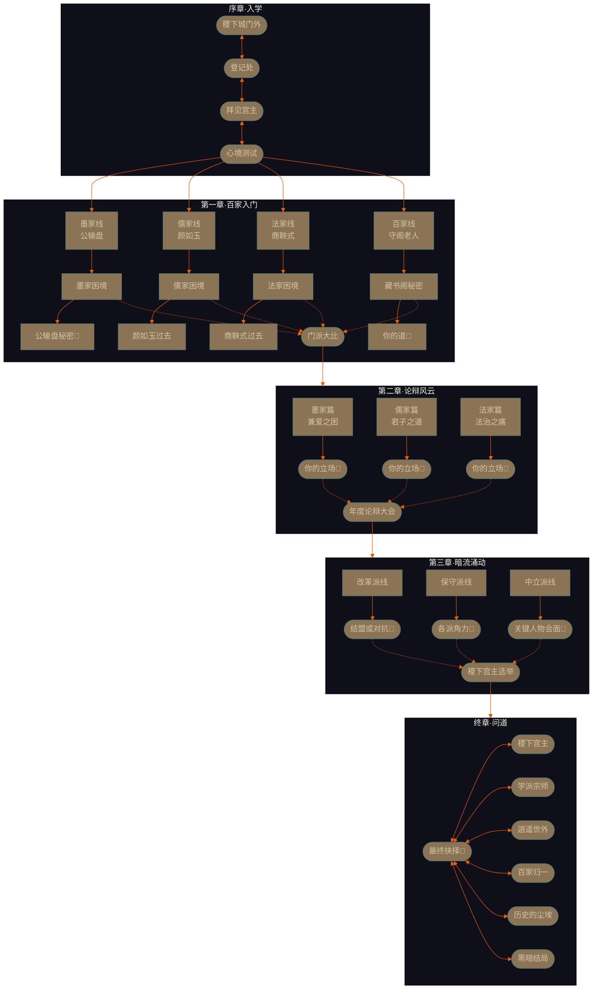

# 稷下学宫·剧情流程图 v1.0

<!--
  Author: Trae AI
  Project: 稷下学宫·问道百家
  Created: 2026-03-27
  LastModified: 2026-03-28
  Purpose: 剧情模式流程图文档
-->

**项目名称**：稷下学宫 - 问道百家剧情模式
**文档版本**：v1.0
**创建日期**：2026-03-27

---

## 第一部分：全局流程图

### 1.1 主线流程总览

```
┌──────────────────────────────────────────────────────────────────────────────┐
│                           稷下学宫·问道百家                                  │
│                           完整剧情流程总览                                    │
└──────────────────────────────────────────────────────────────────────────────┘

┌─────────────┐
│   序章      │
│  《入学》   │
└──────┬──────┘
       │
       ▼
┌──────────────────────────────────────────────────────────────────────────────┐
│  序章节点列表：                                                               │
│  ├── 节点0.1: 稷下城门外（初始选择求学初衷）                                   │
│  ├── 节点0.2: 入学登记处（对话选择影响初始关系）                                 │
│  ├── 节点0.3: 拜见稷下宫主（推荐人死讯·关键抉择）                               │
│  └── 节点0.4: 心境测试（三个幻境场景·分支触发）                                │
└──────────────────────────────────────────────────────────────────────────────┘
       │
       ▼
┌─────────────┐
│  第一章     │
│ 《百家入门》│
└──────┬──────┘
       │
       ▼
┌──────────────────────────────────────────────────────────────────────────────┐
│  第一章分支（基于心境测试结果和序章选择）：                                      │
│                                                                              │
│  ┌────────────────┐  ┌────────────────┐  ┌────────────────┐  ┌────────────────┐│
│  │   墨家线       │  │   儒家线       │  │   法家线       │  │   百家线       ││
│  │   （公输盘）    │  │   （颜如玉）    │  │   （商鞅式）    │  │   （守阁老人）  ││
│  └────────┬───────┘  └────────┬───────┘  └────────┬───────┘  └────────┬───────┘│
│           │                   │                   │                   │        │
│           ▼                   ▼                   ▼                   ▼        │
│  ┌────────────────┐  ┌────────────────┐  ┌────────────────┐  ┌────────────────┐│
│  │ 节点1.1: 入门   │  │ 节点1.1: 入门   │  │ 节点1.1: 入门   │  │ 节点1.1: 偶遇   ││
│  │ 仪式           │  │ 仪式           │  │ 仪式           │  │ 守阁老人       ││
│  └────────┬───────┘  └────────┬───────┘  └────────┬───────┘  └────────┬───────┘│
│           │                   │                   │                   │        │
│           ▼                   ▼                   ▼                   ▼        │
│  ┌────────────────┐  ┌────────────────┐  ┌────────────────┐  ┌────────────────┐│
│  │ 节点1.2:       │  │ 节点1.2:       │  │ 节点1.2:       │  │ 节点1.2:       ││
│  │ 墨家困境       │  │ 儒家困境       │  │ 法家困境       │  │ 藏书阁秘密     ││
│  │（兼爱vs非攻）  │  │（出仕vs独善）  │  │（审判的代价）  │  │（各派阴暗面）  ││
│  └────────┬───────┘  └────────┬───────┘  └────────┬───────┘  └────────┬───────┘│
│           │                   │                   │                   │        │
│           ▼                   ▼                   ▼                   ▼        │
│  ┌────────────────┐  ┌────────────────┐  ┌────────────────┐  ┌────────────────┐│
│  │ 节点1.3:       │  │ 节点1.3:       │  │ 节点1.3:       │  │ 节点1.3:       ││
│  │ 外来者挑战     │  │ 政治阴谋初现   │  │ 法家清洗       │  │ 守阁老人身份   ││
│  └────────┬───────┘  └────────┬───────┘  └────────┬───────┘  └────────┬───────┘│
│           │                   │                   │                   │        │
│           ▼                   ▼                   ▼                   ▼        │
│  ┌────────────────┐  ┌────────────────┐  ┌────────────────┐  ┌────────────────┐│
│  │ 节点1.4:       │  │ 节点1.4:       │  │ 节点1.4:       │  │ 节点1.4:       ││
│  │ 公输盘秘密     │  │ 颜如玉过去     │  │ 商鞅式过去     │  │ 你的道         ││
│  │ （关键抉择🔴） │  │                │  │                │  │ （关键抉择🔴） ││
│  └────────┬───────┘  └────────┬───────┘  └────────┬───────┘  └────────┬───────┘│
│           │                   │                   │                   │        │
└───────────┼───────────────────┼───────────────────┼───────────────────┼────────┘
            │                   │                   │                   │
            └───────────────────┴───────────────────┴───────────────────┘
                                   │
                                   ▼
┌──────────────────────────────────────────────────────────────────────────────┐
│                         【汇聚节点】第一章·门派大比                           │
│                                                                              │
│  所有主线玩家在此汇聚，参与年度论辩大会。                                      │
│  根据之前选择，各派势力格局已经不同。                                          │
│                                                                              │
│  🔴 关键抉择: 在门派大比中的立场                                             │
│  ├── 支持我方门派 → 门派声望大幅提升                                          │
│  ├── 中立观望 → 名望小幅提升，各派印象中等                                    │
│  └── 揭露门派问题 → 本派声望下降，但获得其他派系认可                           │
└──────────────────────────────────────────────────────────────────────────────┘
                                   │
                                   ▼
┌─────────────┐
│  第二章     │
│ 《论辩风云》│
└──────┬──────┘
       │
       ▼
┌──────────────────────────────────────────────────────────────────────────────┐
│  第二章分支（基于第一章选择和门派大比结果）：                                  │
│                                                                              │
│  ┌────────────────┐  ┌────────────────┐  ┌────────────────┐                  │
│  │   墨家篇       │  │   儒家篇       │  │   法家篇       │                  │
│  │   兼爱之困     │  │   君子之道     │  │   法治之痛     │                  │
│  └────────┬───────┘  └────────┬───────┘  └────────┬───────┘                  │
│           │                   │                   │                          │
│           ▼                   ▼                   ▼                          │
│  ┌────────────────┐  ┌────────────────┐  ┌────────────────┐                  │
│  │ 节点2.1:       │  │ 节点2.1:       │  │ 节点2.1:       │                  │
│  │ 墨家分裂       │  │ 儒法之争       │  │ 律令改革       │                  │
│  └────────┬───────┘  └────────┬───────┘  └────────┬───────┘                  │
│           │                   │                   │                          │
│           ▼                   ▼                   ▼                          │
│  ┌────────────────┐  ┌────────────────┐  ┌────────────────┐                  │
│  │ 节点2.2:       │  │ 节点2.2:       │  │ 节点2.2:       │                  │
│  │ 战争阴云       │  │ 权贵勾结       │  │ 酷刑争议       │                  │
│  └────────┬───────┘  └────────┬───────┘  └────────┬───────┘                  │
│           │                   │                   │                          │
│           ▼                   ▼                   ▼                          │
│  ┌────────────────┐  ┌────────────────┐  ┌────────────────┐                  │
│  │ 节点2.3:       │  │ 节点2.3:       │  │ 节点2.3:       │                  │
│  │ 你的立场       │  │ 你的立场       │  │ 你的立场       │                  │
│  │ （关键抉择🔴） │  │ （关键抉择🔴） │  │ （关键抉择🔴） │                  │
│  └────────┬───────┘  └────────┬───────┘  └────────┬───────┘                  │
│           │                   │                   │                          │
└───────────┼───────────────────┼───────────────────┼──────────────────────────┘
            │                   │                   │
            └───────────────────┴───────────────────┘
                                   │
                                   ▼
┌──────────────────────────────────────────────────────────────────────────────┐
│                         【汇聚节点】第二章·年度论辩大会                         │
│                                                                              │
│  论辩主题: "何为天下正道？"                                                   │
│                                                                              │
│  所有玩家在此参与年度最高级别论辩。                                            │
│  你的表现将决定各派势力消长。                                                  │
│                                                                              │
│  🔴 关键抉择: 你支持的"正道"                                                 │
│  ├── 兼爱非攻 → 墨家立场                                                      │
│  ├── 仁义王道 → 儒家立场                                                      │
│  ├── 严刑峻法 → 法家立场                                                      │
│  ├── 无为而治 → 道家立场                                                      │
│  ├── 利益至上 → 纵横家立场                                                   │
│  └── ……或提出自己的"道"                                                    │
└──────────────────────────────────────────────────────────────────────────────┘
                                   │
                                   ▼
┌─────────────┐
│  第三章     │
│《暗流涌动》 │
└──────┬──────┘
       │
       ▼
┌──────────────────────────────────────────────────────────────────────────────┐
│  第三章分支:                                                                   │
│                                                                              │
│  根据前两章选择，玩家进入不同分支:                                              │
│                                                                              │
│  ┌────────────────┐  ┌────────────────┐  ┌────────────────┐                  │
│  │   改革派结局   │  │   保守派结局   │  │   中立派结局   │                  │
│  │   支持变革     │  │   维护传统     │  │   超然物外     │                  │
│  └────────┬───────┘  └────────┬───────┘  └────────┬───────┘                  │
│           │                   │                   │                          │
│           ▼                   ▼                   ▼                          │
│  ┌────────────────┐  ┌────────────────┐  ┌────────────────┐                  │
│  │ 阴谋线         │  │ 权力线         │  │ 真相线         │                  │
│  │ 揭露学宫黑暗面 │  │ 稷下宫主选举   │  │ 探索学宫秘密   │                  │
│  └────────┬───────┘  └────────┬───────┘  └────────┬───────┘                  │
│           │                   │                   │                          │
│           ▼                   ▼                   ▼                          │
│  ┌────────────────┐  ┌────────────────┐  ┌────────────────┐                  │
│  │ 节点3.2:       │  │ 节点3.2:       │  │ 节点3.2:       │                  │
│  │ 结盟或对抗     │  │ 各派角力       │  │ 关键人物会面   │                  │
│  │ （关键抉择🔴） │  │ （关键抉择🔴） │  │ （关键抉择🔴） │                  │
│  └────────┬───────┘  └────────┬───────┘  └────────┬───────┘                  │
│           │                   │                   │                          │
└───────────┼───────────────────┼───────────────────┼──────────────────────────┘
            │                   │                   │
            └───────────────────┴───────────────────┘
                                   │
                                   ▼
┌─────────────┐
│   终章      │
│  《问道》   │
└──────┬──────┘
       │
       ▼
┌──────────────────────────────────────────────────────────────────────────────┐
│                                                                              │
│  🔴 最终关键抉择: "你的道是什么？"                                            │
│                                                                              │
│  ┌─────────────┐ ┌─────────────┐ ┌─────────────┐ ┌─────────────┐            │
│  │  稷下宫主   │ │  学派宗师   │ │  逍遥世外   │ │  百家归一   │            │
│  │             │ │             │ │             │ │             │            │
│  │ 成为学宫   │ │ 成为某派   │ │ 归隐山林   │ │ 超越门派   │            │
│  │ 最高领导   │ │ 代表人物   │ │ 道法自然   │ │ 自成一派   │            │
│  └─────────────┘ └─────────────┘ └─────────────┘ └─────────────┘            │
│                                                                              │
└──────────────────────────────────────────────────────────────────────────────┘
                                   │
                                   ▼
                              ┌─────────┐
                              │  尾声   │
                              │ 结局呈现│
                              └─────────┘
```

---

## 第二部分：分支路径详解

### 2.1 序章分支路径

```
序章·入学
│
├─► 节点0.1: 求学初衷
│   │
│   ├─ [A] 学成本事报国 → 勇气+2, 魅力+1, 兵家线倾向
│   ├─ [B] 探究天下真理 → 智慧+2, 洞察+1, 名家线倾向
│   ├─ [C] 结交天下英杰 → 魅力+2, 勇气+1, 纵横家线倾向
│   └─ [D] 看看世间运行之道 → 洞察+2, 智慧+1, 道家线倾向
│
├─► 节点0.2: 入学登记
│   │
│   ├─ [A] 直言版 → 勇气相关NPC初始好感+
│   ├─ [B] 婉言版 → 魅力相关NPC初始好感+
│   ├─ [C] 反问版 → 智慧相关NPC初始好感+
│   └─ [D] 沉默版 → 洞察相关NPC初始好感+
│
├─► 节点0.3: 拜见宫主
│   │
│   ├─ [A] 震惊悲伤 → 勇气+2, 宫主信任-5
│   ├─ [B] 愤怒质问 → 勇气+3, 宫主信任+3
│   ├─ [C] 冷静追问 → 智慧+2, 宫主信任+5
│   └─ [D] 沉默聆听 → 洞察+2, 宫主信任+8
│
└─► 节点0.4: 心境测试（第一层分支）
    │
    ├─► 墨家之影
    │   ├─ [A] 帮助墨家弟子 → 勇气判定
    │   ├─ [B] 尝试调停 → 魅力判定
    │   ├─ [C] 观察局势 → 洞察判定
    │   └─ [D] 避开冲突 → 无判定，但不触发墨家线
    │
    ├─► 法家之影
    │   ├─ [A] 支持法家判决 → 智慧判定
    │   ├─ [B] 为小偷求情 → 魅力判定
    │   ├─ [C] 提出折中方案 → 综合判定
    │   └─ [D] 质疑法律本身 → 洞察判定
    │
    └─► 道家之影
        ├─ [A] 要权倾天下 → 兵家/纵横家线倾向
        ├─ [B] 要学贯百家 → 儒家/名家线倾向
        ├─ [C] 要回家 → 道家线倾向
        └─ [D] 不知道 → 百家线开启条件之一
```

### 2.2 第一章分支矩阵

```
第一章分支触发规则：

┌─────────────────────────────────────────────────────────────────────────────┐
│                         第一章入口判定表                                      │
├─────────────────────────────────────────────────────────────────────────────┤
│                                                                             │
│  触发条件                        │  入口章节          │  核心NPC              │
│ ─────────────────────────────────┼────────────────────┼─────────────────────│
│  墨家之影选择帮助+道家选择回家    │  墨家线            │  公输盘               │
│                                                                             │
│  法家之影选择支持判决+道家选择学贯│  法家线            │  商鞅式人物           │
│                                                                             │
│  儒家倾向选择≥2次                 │  儒家线            │  颜如玉               │
│                                                                             │
│  所有心境测试选择"中立/观望"     │  百家线（隐藏）    │  守阁老人             │
│                                                                             │
│  无明显倾向但名望≥20             │  默认百家线        │  守阁老人             │
│                                                                             │
│  其他情况                        │  儒家线（保底）    │  颜如玉               │
│                                                                             │
└─────────────────────────────────────────────────────────────────────────────┘
```

### 2.3 关键节点分支

```
【关键节点1】公输盘的秘密（墨家线·节点1.4）

触发条件：
├── 墨家线进行中
├── 公输盘好感≥60
└── 已发现"秘密武器"线索

分支选项：

[A] 🔴 告发此事
    ├── 影响: 墨家声望-30, 法家声望+20, 公输盘好感-50
    ├── 后续: 法家线提前开启，但与公输盘决裂
    └── 结局: 墨家线失败，转为法家相关结局

[B] 🔴 支持公输盘
    ├── 影响: 墨家声望+20, 公输盘好感+30
    ├── 后续: 墨家线继续深化，但法家敌意大增
    └── 结局: 墨家线继续，通向特定结局

[C] 🔴 为他保密，但劝他放弃
    ├── 影响: 墨家声望±0, 公输盘好感+20
    ├── 后续: 公输盘陷入内心挣扎
    └── 结局: 可能触发墨家线隐藏分支

[D] 🔴 加入他，一起承担
    ├── 影响: 墨家声望+15, 公输盘好感+40, 勇气+5
    ├── 后续: 命运与墨家绑定
    └── 结局: 墨家线完全开启


【关键节点2】稷下宫主选举（第三章·汇聚节点）

触发条件：
├── 完成前两章
├── 名望≥50
└── 至少一个门派声望≥60

分支选项：

[A] 🔴 支持颜如玉（儒家）
    ├── 影响: 儒家声望+30, 其他部分门派-10
    ├── 后续: 儒家全面掌权
    └── 结局: 儒家路线

[B] 🔴 支持商鞅式人物（法家）
    ├── 影响: 法家声望+30, 墨家-20
    ├── 后续: 法家铁腕统治
    └── 结局: 法家路线

[C] 🔴 支持守阁老人（中立）
    ├── 影响: 各派声望变化小, 开启隐藏线
    ├── 后续: 学宫改革
    └── 结局: 百家归一路线

[D] 🔴 自立参选
    ├── 影响: 所有门派-15, 名望+20
    ├── 后续: 需要面对所有门派的挑战
    └── 结局: 稷下宫主路线（需高名望）


【关键节点3】你的道是什么？（终章）

触发条件：
├── 完成主线剧情
└── 满足任一结局条件

分支选项：

[A] 稷下宫主之道
    ├── 条件: 名望≥100, 任一门派声望≥90, 宫主信任≥80
    └── 结局: 成为新一代稷下宫主

[B] 学派宗师之道
    ├── 条件: 单派声望≥100, 其他条件满足
    └── 结局: 成为某派代表性人物

[C] 逍遥世外之道
    ├── 条件: 道家线完成, 智慧≥8, 洞察≥8
    └── 结局: 归隐山林, 超然物外

[D] 百家归一之道
    ├── 条件: 所有主要门派声望≥50, 完成百家线
    └── 结局: 超越门派, 自成一派

[E] 历史的尘埃（悲剧结局）
    ├── 条件: 主要条件均未满足
    └── 结局: 默默无闻, 或死于阴谋

[F] 黑暗之道
    ├── 条件: 多次极端选择, 好感度普遍为负
    └── 结局: 走上歧途, 身败名裂
```

---

## 第三部分：剧情流程图（Mermaid格式）



---

## 第四部分：关系变化流程

### 4.1 关系值影响总表

```
┌─────────────────────────────────────────────────────────────────────────────┐
│                              关系值影响总表                                   │
├─────────────────────────────────────────────────────────────────────────────┤
│                                                                             │
│  【序章选择影响】                                                            │
│                                                                             │
│  选择类型          │  稷下宫主  │  学术长老  │  守阁老人  │  神秘商人         │
│  ─────────────────┼───────────┼───────────┼───────────┼───────────────    │
│  直言版            │   +3      │   +5      │   0       │   -3              │
│  婉言版            │   +5      │   +3      │   0       │   +5              │
│  反问版            │   +5      │   +0      │   +5      │   +3              │
│  沉默版            │   +8      │   -5      │   +8      │   +0              │
│                                                                             │
│  【心境测试选择影响】                                                        │
│                                                                             │
│  选择类型          │  墨家     │  儒家     │  法家     │  道家             │
│  ─────────────────┼──────────┼──────────┼──────────┼─────────────       │
│  帮助墨家          │   +20    │   +0     │   -10    │   +5              │
│  支持法家          │   -10    │   +0     │   +20    │   +0              │
│  为弱者求情        │   +5     │   +15    │   -5     │   +10             │
│  质疑权威          │   +0     │   -10    │   -15    │   +20             │
│                                                                             │
│  【关键抉择影响】                                                            │
│                                                                             │
│  抉择              │  墨家     │  儒家     │  法家     │  道家    │ 名望   │
│  ─────────────────┼──────────┼──────────┼──────────┼─────────┼─────────    │
│  告发公输盘        │   -30    │   +0     │   +20    │   +5    │  +15    │
│  支持公输盘        │   +20    │   +0     │   -15    │   +0    │  -5     │
│  保密并劝说        │   +10    │   +0     │   +10    │   +10   │  +5     │
│  加入他一起承担    │   +30    │   +0     │   -20    │   +5    │  +0     │
│                                                                             │
└─────────────────────────────────────────────────────────────────────────────┘
```

### 4.2 关系值与剧情解锁

```
关系值解锁表：

┌─────────────────────────────────────────────────────────────────────────────┐
│                          儒家·颜如玉                                         │
├─────────────────────────────────────────────────────────────────────────────┤
│  好感值    │  信任值    │  解锁内容                                          │
│ ──────────┼──────────┼───────────────────────────────────────────────────  │
│  0-29     │  0-29    │  基础对话, 日常任务                                    │
│  30-49    │  30-49   │  儒家基础教学内容, 普通任务                             │
│  50-69    │  50-69   │  颜如玉邀请喝茶, 了解儒家历史                          │
│  70-89    │  70-89   │  颜如玉分享内心困惑, 进阶任务                          │
│  90+      │  90+     │  颜如玉秘密剧情, 儒家秘传, 结局相关                     │
│                                                                             │
│  ⚠️ 特殊: 好感或信任任一低于-50 → 儒家线变为敌对分支                          │
└─────────────────────────────────────────────────────────────────────────────┘

┌─────────────────────────────────────────────────────────────────────────────┐
│                          墨家·公输盘                                         │
├─────────────────────────────────────────────────────────────────────────────┤
│  好感值    │  信任值    │  解锁内容                                          │
│ ──────────┼──────────┼───────────────────────────────────────────────────  │
│  0-29     │  0-29    │  基础对话, 机关工坊参观                                │
│  30-49    │  30-49   │  墨家基础教学内容, 制造任务                             │
│  50-69    │  50-69   │  进入核心工坊, 了解墨家困境                            │
│  70-89    │  70-89   │  公输盘信任, 秘密武器线                               │
│  90+      │  90+     │  完整秘密剧情, 墨家秘传, 结局相关                       │
│                                                                             │
│  ⚠️ 特殊: 好感或信任任一低于-50 → 墨家线变为敌对分支                          │
└─────────────────────────────────────────────────────────────────────────────┘

┌─────────────────────────────────────────────────────────────────────────────┐
│                          法家·商鞅式人物                                       │
├─────────────────────────────────────────────────────────────────────────────┤
│  好感值    │  信任值    │  解锁内容                                          │
│ ──────────┼──────────┼───────────────────────────────────────────────────  │
│  0-29     │  0-29    │  基础对话, 旁听审判                                    │
│  30-49    │  30-49   │  法家基础教学内容, 观察任务                            │
│  50-69    │  50-69   │  参与审判讨论, 了解法家理念                            │
│  70-89    │  70-89   │  商鞅式认可, 深层任务                                 │
│  90+      │  90+     │  法家终极秘密, 法家秘传, 结局相关                      │
│                                                                             │
│  ⚠️ 特殊: 好感或信任任一低于-50 → 法家线变为敌对分支                          │
└─────────────────────────────────────────────────────────────────────────────┘
```

---

## 第五部分：时间线与节点对照

### 5.1 完整时间线

```
┌─────────────────────────────────────────────────────────────────────────────┐
│                           稷下学宫·剧情时间线                                 │
├─────────────────────────────────────────────────────────────────────────────┤
│                                                                             │
│  【第一年·春】  入学季                                                       │
│                                                                             │
│  时间节点          │  剧情章节           │  主要内容                         │
│  ─────────────────┼────────────────────┼───────────────────────────────    │
│  第一月            │  序章               │  入学, 心境测试, 选择门派           │
│  第二-三月          │  第一章前篇         │  门派学习, 日常任务                │
│  第四月            │  第一章中篇         │  各派困境, 第一次冲突              │
│  第五-六月          │  第一章后篇         │  门派大比, 第一次抉择               │
│                                                                             │
│  【第一年·秋】  论辩季                                                        │
│                                                                             │
│  时间节点          │  剧情章节           │  主要内容                         │
│  ─────────────────┼────────────────────┼───────────────────────────────    │
│  第七-八月          │  第二章前篇         │  论辩准备, 派系争斗                │
│  第九-十月          │  第二章中篇         │  年度论辩大会, 第二次抉择          │
│  第十一-十二月      │  第二章后篇         │  论辩后果, 势力变化                │
│                                                                             │
│  【第二年·冬】  暗流季                                                        │
│                                                                             │
│  时间节点          │  剧情章节           │  主要内容                         │
│  ─────────────────┼────────────────────┼───────────────────────────────    │
│  第十三个月         │  第三章前篇         │  阴谋浮现, 真相揭露                │
│  第十四五月          │  第三章中篇         │  各派站队, 第三次抉择              │
│  第十五-十八月       │  第三章后篇         │  稷下宫主选举, 最终准备            │
│                                                                             │
│  【第三年·春】  问道季                                                        │
│                                                                             │
│  时间节点          │  剧情章节           │  主要内容                         │
│  ─────────────────┼────────────────────┼───────────────────────────────    │
│  第十九-二十月      │  终章               │  最终抉择, 结局呈现, 尾声           │
│                                                                             │
└─────────────────────────────────────────────────────────────────────────────┘
```

### 5.2 节点-章节对照

```
快速索引：

第一章节点：
├── 1.0  门派选择确认
├── 1.1  入门仪式/偶遇
├── 1.2  门派困境
├── 1.3  外部挑战/阴谋
├── 1.4  核心秘密（关键抉择🔴）
├── 1.5  门派大比（汇聚节点）

第二章节点：
├── 2.0  第二章开始
├── 2.1  势力变化
├── 2.2  派系冲突
├── 2.3  立场选择（关键抉择🔴）
├── 2.4  年度论辩大会（汇聚节点）

第三章节点：
├── 3.0  第三章开始
├── 3.1  阴谋线/权力线/真相线
├── 3.2  最终站队（关键抉择🔴）
├── 3.3  稷下宫主选举

终章节点：
├── F.0  最终确认
├── F.1  最终抉择（关键抉择🔴）
└── F.2  结局呈现
```

---

**文档状态**：v1.0 流程图完成

---

*最后更新：2026-03-27*
